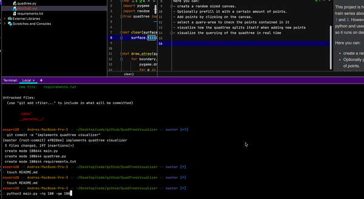

# QuadTreeVisualizer

This project is heavily inspired by the coding-train series about quadtrees.
Especially parts [1](https://thecodingtrain.com/CodingChallenges/098.1-quadtree.html) and [2](https://thecodingtrain.com/CodingChallenges/098.2-quadtree.html).
However this version is written in python and uses pygame for the visualization so it runs on desktop instead of the browser.

## Here you can:
- create a random sized canvas.
- Optionally prefill it with a certain amount of points.
- Add points by clicking on the canvas.
- select a query-area to check the points contained in it
- visualize how the quadtree splits itself when adding new points
- visualize the querying of the quadtree in real time
